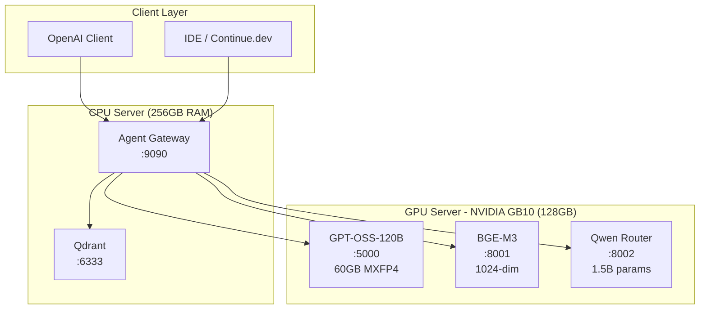
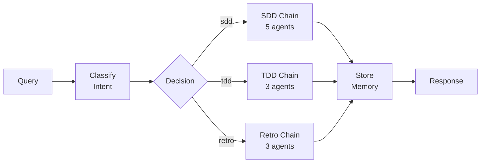
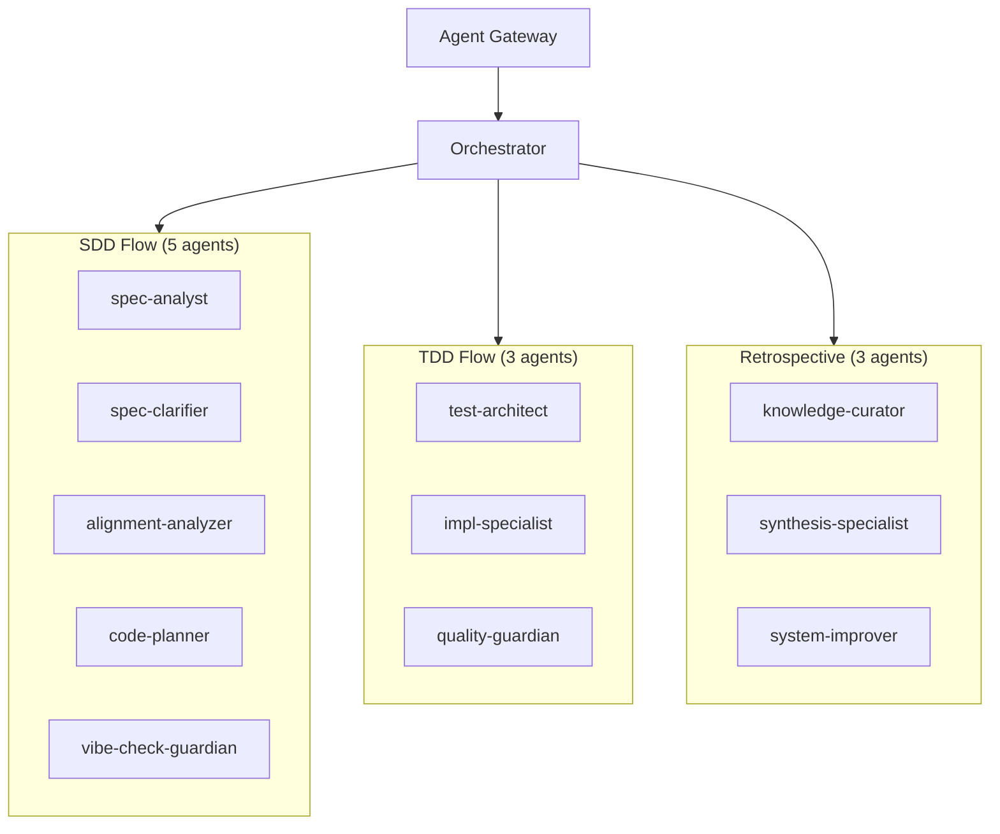

# Vision Model

Multi-model LLM orchestration system designed for NVIDIA GB10 (sm_121) with 128GB unified memory. Intelligently routes queries between specialized LLM models based on complexity, with agent-based development workflows and vector-based memory.

## System Architecture



**Full architecture documentation**: [docs/ARCHITECTURE.md](docs/ARCHITECTURE.md)

---

## Quick Start

### Prerequisites

- Python 3.11+
- NVIDIA GB10 GPU with 128GB unified memory (for LLM services)
- Qdrant vector database
- Docker & Docker Compose (for Qdrant)

### 1. Clone and Setup Environment

```bash
cd /opt/vision_model

# Create virtual environment
python3 -m venv venv
source venv/bin/activate

# Install dependencies
pip install -r requirements.txt

# Copy environment template
cp .env.example .env
```

### 2. Configure Environment

Edit `.env` with your settings:

```bash
# GPU Server endpoints (LLM services)
GPT_OSS_URL=http://GPU_SERVER_IP:5000
BGE_M3_URL=http://GPU_SERVER_IP:8001
QWEN_ROUTER_URL=http://GPU_SERVER_IP:8002

# Qdrant (local or remote)
QDRANT_URL=http://localhost:6333

# Agent Gateway
AGENT_PORT=9090
GB10_URL=http://GPU_SERVER_IP:8080

# Timeouts
ROUTER_TIMEOUT=10
EMBEDDING_TIMEOUT=30
LLM_TIMEOUT=120
```

### 3. Start Qdrant

```bash
# Using Docker Compose
docker-compose -f docker-compose-qdrant.yaml up -d

# Verify Qdrant is running
curl http://localhost:6333/health
```

### 4. Start the Agent Gateway

```bash
source venv/bin/activate
python -m src.agents.gateway
```

Output:
```
Agent Gateway starting on port 9090
   GB10: http://192.168.51.22:8080
   Qdrant: http://localhost:6333
   Agents: 14
```

### 5. Verify Health

```bash
curl http://localhost:9090/health
```

---

## Query Processing Pipeline



Every query goes through:
1. **Intent Classification** - Classify as SDD/TDD/Retro using Qwen
2. **Chain Selection** - Route to appropriate agent chain
3. **Agent Execution** - Run agents in sequence with context passing
4. **Memory Storage** - Store conversation for future context

---

## API Usage

### Primary Endpoint (OpenAI-Compatible)

```bash
curl -X POST http://localhost:9090/v1/chat/completions \
  -H "Content-Type: application/json" \
  -d '{
    "model": "orchestrator",
    "messages": [{"role": "user", "content": "Help me plan a new feature"}],
    "temperature": 0.7,
    "max_tokens": 4096,
    "user": "user-123"
  }'
```

### Using OpenAI Python Client

```python
from openai import OpenAI

client = OpenAI(
    base_url="http://localhost:9090/v1",
    api_key="not-needed"
)

response = client.chat.completions.create(
    model="orchestrator",  # or specific agent like "spec-analyst"
    messages=[{"role": "user", "content": "Help me write tests for the auth module"}],
    user="user-123"
)
print(response.choices[0].message.content)
```

### Available Models/Agents

```bash
curl http://localhost:9090/v1/models
```

| Model | Description |
|-------|-------------|
| `orchestrator` | Auto-routes to best flow (SDD/TDD/Retro) |
| `sdd` | Specification-Driven Development chain |
| `tdd` | Test-Driven Development chain |
| `retro` | Retrospective Analysis chain |
| `spec-analyst` | Analyzes requirements |
| `spec-clarifier` | Identifies ambiguities |
| `test-architect` | Designs test strategy (RED) |
| `code-planner` | Designs architecture |
| `implementation-specialist` | Makes tests pass (GREEN) |
| `quality-guardian` | Refactors, security scan |
| `knowledge-curator` | Extracts learnings |
| `synthesis-specialist` | Aggregates retrospectives |
| `system-improver` | Recommends improvements |
| `vibe-check-guardian` | Challenges assumptions |

### API Endpoints

| Endpoint | Method | Purpose |
|----------|--------|---------|
| `/health` | GET | Service health + agent list |
| `/v1/models` | GET | List available agents |
| `/v1/chat/completions` | POST | Main chat endpoint (OpenAI-compatible) |

---

## Agent Architecture



---

## Development

### Run Tests

```bash
source venv/bin/activate

# Run all tests (225 tests)
pytest tests/ -v

# Run specific test file
pytest tests/agents/test_gateway.py -v

# Run with coverage
pytest tests/ --cov=src --cov-report=html
```

### Project Structure

```
vision_model/
├── src/
│   └── agents/
│       ├── gateway.py           # FastAPI app (port 9090)
│       ├── orchestrator.py      # Intent classification & routing
│       ├── memory/
│       │   └── client.py        # Qdrant memory client
│       ├── chains/
│       │   ├── base.py          # Base chain class
│       │   ├── sdd.py           # SDD chain (5 agents)
│       │   ├── tdd.py           # TDD chain (3 agents)
│       │   └── retro.py         # Retro chain (3 agents)
│       ├── agents/
│       │   ├── base.py          # Base agent class
│       │   └── runner.py        # Agent execution
│       ├── prompts/             # Agent prompts (markdown)
│       └── constitution/        # Development principles
├── tests/
│   └── agents/                  # Test suite (225 tests)
├── docs/
│   └── ARCHITECTURE.md          # Full architecture docs
├── collections/                 # Qdrant collection configs
├── docker-compose-qdrant.yaml   # Qdrant deployment
├── .env.example                 # Environment template
└── CLAUDE.md                    # AI assistant guidelines
```

---

## Service Ports

| Service | Port | Server | Purpose |
|---------|------|--------|---------|
| Agent Gateway | 9090 | CPU | OpenAI-compatible API |
| Qdrant | 6333 | CPU | Vector database |
| GPT-OSS-120B | 5000 | GPU | Main reasoning LLM |
| BGE-M3 | 8001 | GPU | Embeddings (1024-dim) |
| Qwen Router | 8002 | GPU | Classification |

---

## Memory Layout (GB10 128GB)

| Component | Memory |
|-----------|--------|
| GPT-OSS-120B | ~60GB (MXFP4) |
| BGE-M3 | ~2GB (FP8) |
| Qwen Router | ~3GB (FP8) |
| **Free for KV Cache** | ~63GB |

---

## Logs and Monitoring

```bash
# View logs (stdout when running)
python -m src.agents.gateway

# Check service health
curl http://localhost:9090/health

# List agents
curl http://localhost:9090/v1/models
```

---

## Stopping Services

```bash
# Stop gateway (Ctrl+C or)
pkill -f "src.agents.gateway"

# Stop Qdrant
docker-compose -f docker-compose-qdrant.yaml down
```

---

## Documentation

- [Architecture](docs/ARCHITECTURE.md) - Full system topology and design
- [Constitution](src/agents/constitution/INDEX.md) - Development principles
- [CLAUDE.md](CLAUDE.md) - AI assistant guidelines

---

## Test Status

```
225 passed in 12.39s
```

All agent chains, memory client, gateway, and orchestrator tests passing.
