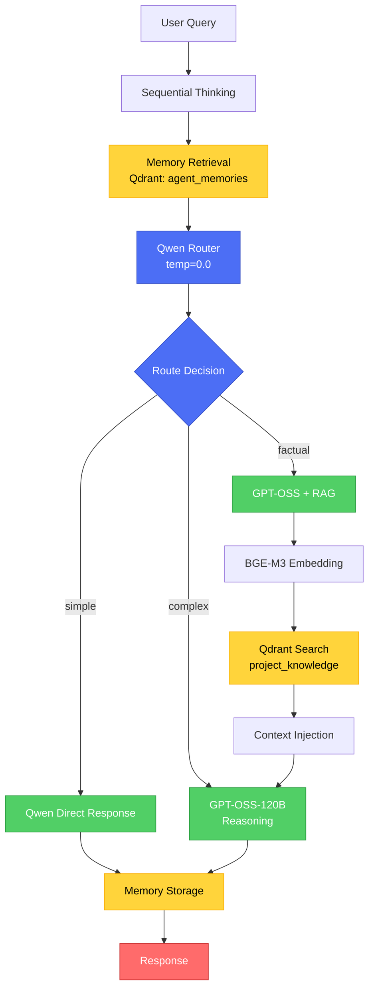
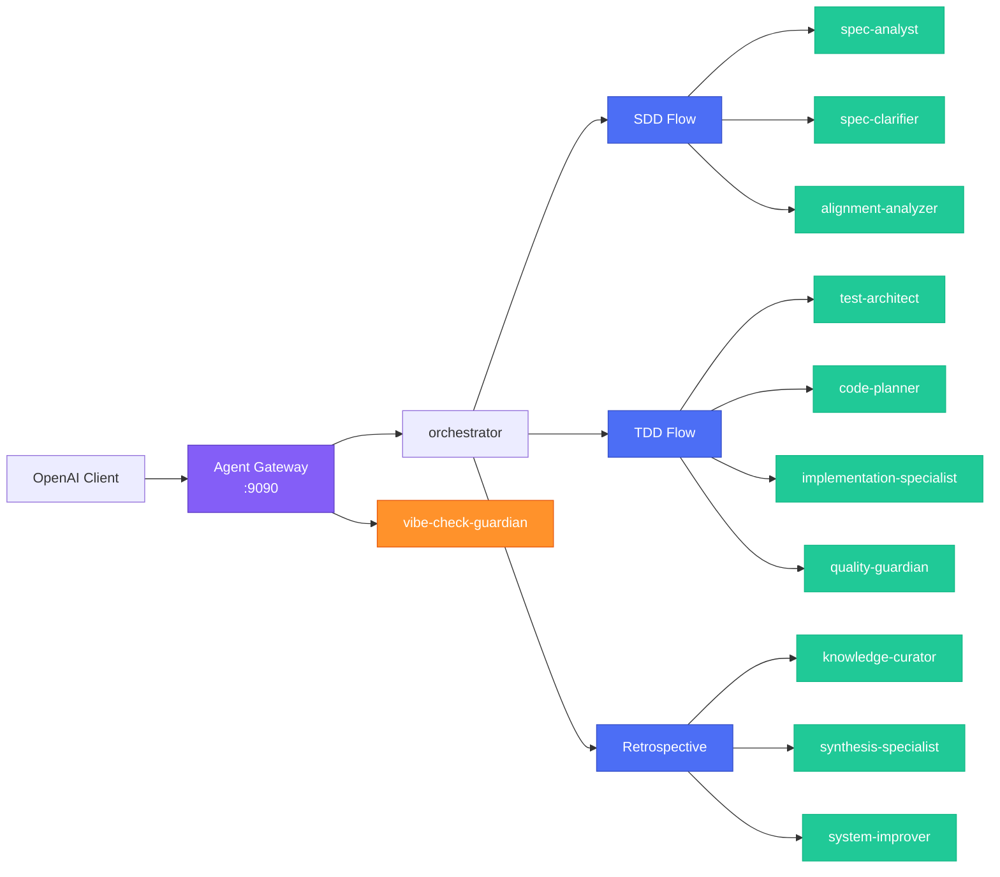
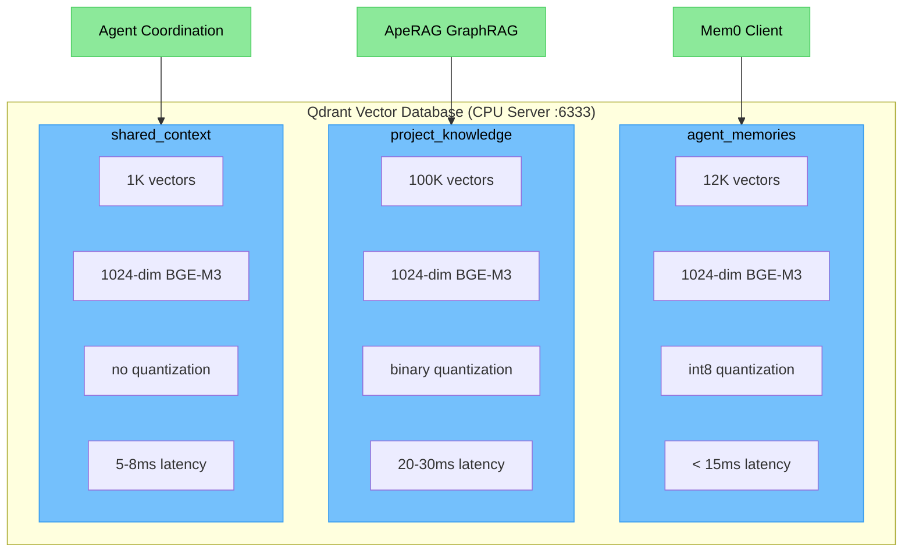
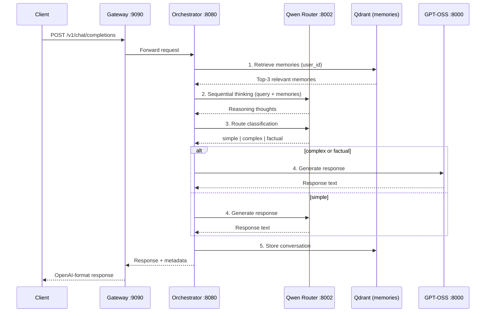

# Vision Model Architecture

**Version**: 1.0.0 | **Last Updated**: 2025-01-25

Multi-model LLM orchestration system designed for NVIDIA GB10 (sm_121) with 128GB unified memory. The system intelligently routes queries between three LLM models based on complexity, with agent-based development workflows and vector-based memory.

---

## System Overview

```
┌─────────────────────────────────────────────────────────────────────────────┐
│                              SYSTEM TOPOLOGY                                 │
├─────────────────────────────────────────────────────────────────────────────┤
│                                                                             │
│   ┌─────────────────────────────────────────┐    ┌─────────────────────┐   │
│   │         GPU SERVER (GB10)               │    │    CPU SERVER       │   │
│   │         128GB Unified Memory            │    │    256GB RAM        │   │
│   │         NVIDIA Blackwell sm_121         │    │    28 Threads       │   │
│   │                                         │    │                     │   │
│   │  ┌─────────────────────────────────┐   │    │  ┌───────────────┐  │   │
│   │  │ GPT-OSS-120B    :8000           │   │    │  │ Qdrant        │  │   │
│   │  │ (60GB, MXFP4)                   │   │    │  │ :6333/:6334   │  │   │
│   │  └─────────────────────────────────┘   │    │  │               │  │   │
│   │  ┌─────────────────────────────────┐   │    │  │ Collections:  │  │   │
│   │  │ BGE-M3          :8001           │   │    │  │ • memories    │  │   │
│   │  │ (2GB, FP8, 1024-dim)            │   │    │  │ • knowledge   │  │   │
│   │  └─────────────────────────────────┘   │    │  │ • context     │  │   │
│   │  ┌─────────────────────────────────┐   │    │  └───────────────┘  │   │
│   │  │ Qwen Router     :8002           │   │    │                     │   │
│   │  │ (3GB, FP8, 1.5B params)         │   │    │  ┌───────────────┐  │   │
│   │  └─────────────────────────────────┘   │    │  │ Agent Gateway │  │   │
│   │  ┌─────────────────────────────────┐   │    │  │ :9090         │  │   │
│   │  │ Orchestrator    :8080           │   │◄───┼──│ (FastAPI)     │  │   │
│   │  │ (FastAPI)                       │   │    │  └───────────────┘  │   │
│   │  └─────────────────────────────────┘   │    │                     │   │
│   │                                         │    │                     │   │
│   │  Free: ~61GB (KV Cache)                │    │                     │   │
│   └─────────────────────────────────────────┘    └─────────────────────┘   │
│                                                                             │
└─────────────────────────────────────────────────────────────────────────────┘
```

---

## LLM Services Layer

### Service Specifications

| Service | Port | Model | Parameters | Quantization | Memory | Purpose |
|---------|------|-------|------------|--------------|--------|---------|
| GPT-OSS | 8000 | GPT-OSS-120B | 120B | MXFP4 | ~60GB | Main reasoning |
| BGE-M3 | 8001 | BGE-M3 | - | FP8 | ~2GB | Embeddings (1024-dim) |
| Qwen Router | 8002 | Qwen2.5-1.5B | 1.5B | FP8 | ~3GB | Query classification |
| Orchestrator | 8080 | - | - | - | ~2GB | API gateway |

### Query Routing Logic



### Routing Categories

| Category | Criteria | Handler | Use RAG |
|----------|----------|---------|---------|
| `simple` | Greetings, basic questions | Qwen 1.5B | No |
| `complex` | Reasoning, analysis, code | GPT-OSS-120B | No |
| `factual` | Documentation, codebase queries | GPT-OSS-120B | Yes |

---

## Agent Architecture

### Agent Gateway (Port 9090)

OpenAI-compatible API that routes requests to 12 specialized agents.



### Agent Registry

| Agent | Role | Flow |
|-------|------|------|
| `orchestrator` | Routes to appropriate flow (SDD/TDD/Retro) | Entry |
| `spec-analyst` | Analyzes requirements, creates specifications | SDD |
| `spec-clarifier` | Identifies ambiguities, asks clarifying questions | SDD |
| `alignment-analyzer` | Verifies spec/tests/architecture alignment | SDD |
| `test-architect` | Designs test strategy, writes failing tests (RED) | TDD |
| `code-planner` | Designs architecture using SOLID principles | TDD |
| `implementation-specialist` | Makes tests pass (GREEN) | TDD |
| `quality-guardian` | Refactors, security scan, production certification | TDD |
| `knowledge-curator` | Extracts learnings from development | Retro |
| `synthesis-specialist` | Aggregates retrospectives | Retro |
| `system-improver` | Recommends system improvements | Retro |
| `vibe-check-guardian` | Challenges assumptions, identifies blind spots | Cross-cutting |

---

## Data Layer

### Qdrant Collections



### Collection Specifications

| Collection | Purpose | Size | Quantization | Latency | Access Pattern |
|------------|---------|------|--------------|---------|----------------|
| `agent_memories` | Mem0 agent long-term memory | 12K vectors | int8 scalar | <15ms | Frequent R/W |
| `project_knowledge` | ApeRAG GraphRAG storage | 100K vectors | Binary | 20-30ms | Read-heavy (90%) |
| `shared_context` | Cross-agent coordination | 1K vectors | None | 5-8ms | Moderate R, Low W |

### Payload Schemas

**agent_memories**
```yaml
user_id: keyword (indexed)      # User identifier
agent_id: keyword (indexed)     # Agent identifier
timestamp: datetime (indexed)   # ISO 8601
memory_type: keyword (indexed)  # conversation | state | preference | learning
session_id: keyword             # Session grouping
project_id: keyword (indexed)   # Project context
```

**project_knowledge**
```yaml
project_id: keyword (indexed)   # Project identifier
doc_type: keyword (indexed)     # code | documentation | diagram | test
file_path: text (indexed)       # Full file path
language: keyword (indexed)     # python | javascript | yaml | etc.
git_commit: keyword             # Git SHA
timestamp: datetime (indexed)   # Last modified
entities: keyword (indexed)     # GraphRAG entities
relationships: keyword          # Entity relationships
```

**shared_context**
```yaml
context_type: keyword (indexed) # task_definition | workflow | preference | system_state
priority: integer (indexed)     # 1-10 priority
created_by_agent: keyword (indexed)
tags: keyword (indexed)         # Categorization
timestamp: datetime (indexed)
status: keyword (indexed)       # active | completed | archived
related_agents: keyword         # Agents needing this context
```

---

## Sequential Thinking Pipeline

Every query through `/v1/chat/completions` follows this pipeline:



---

## API Endpoints

### Gateway API (Port 9090)

| Endpoint | Method | Purpose |
|----------|--------|---------|
| `/health` | GET | Service health + agent list |
| `/v1/models` | GET | List available agents |
| `/v1/chat/completions` | POST | Main chat endpoint (OpenAI-compatible) |

### Orchestrator API (Port 8080)

| Endpoint | Method | Purpose |
|----------|--------|---------|
| `/health` | GET | Service health + LLM status |
| `/v1/chat/completions` | POST | Primary endpoint (sequential thinking + memory) |
| `/query` | POST | Legacy query (no memory/thinking) |
| `/embed` | POST | Generate embeddings (BGE-M3) |
| `/index` | POST | Index documents to Qdrant |

---

## Constitution Framework

The project follows a structured development constitution with 8 core principles:

| Principle | Focus |
|-----------|-------|
| I. MCP-First Architecture | Use MCP servers for tooling |
| II. Test-First Development | TDD is non-negotiable |
| III. Specification-Driven | Create specs before code |
| IV. Comprehensive Planning | Plan based on complexity |
| V. Security and Quality Gates | Semgrep, tests, coverage |
| VI. Knowledge Management | Capture learnings |
| VII. Documentation Excellence | Keep docs current |
| VIII. Token-Efficient Architecture | Optimize for AI comprehension |

See: [Constitution INDEX](../src/agents/constitution/INDEX.md)

---

## Deployment Topology

```
┌──────────────────────────────────────────────────────────────────┐
│                     DEPLOYMENT ARCHITECTURE                       │
├──────────────────────────────────────────────────────────────────┤
│                                                                  │
│  MacBook (Development)                                           │
│  ├── Continue.dev / OpenAI Client                               │
│  └── base_url: http://CPU_SERVER_IP:9090/v1                     │
│           │                                                      │
│           ▼                                                      │
│  ┌────────────────────────────────────────────────────────┐     │
│  │ CPU Server (256GB RAM, 28 threads)                      │     │
│  │ ├── Agent Gateway (:9090) ──────────────────────┐      │     │
│  │ │     FastAPI, routes to agents                  │      │     │
│  │ │                                                │      │     │
│  │ └── Qdrant (:6333) ◄─────────────────────────────┼──┐  │     │
│  │       ├── agent_memories (Mem0)                  │  │  │     │
│  │       ├── project_knowledge (ApeRAG)             │  │  │     │
│  │       └── shared_context                         │  │  │     │
│  └──────────────────────────────────────────────────┼──┼──┘     │
│                                                     │  │         │
│                                                     ▼  │         │
│  ┌────────────────────────────────────────────────────────┐     │
│  │ GPU Server - NVIDIA GB10 (128GB unified memory)         │     │
│  │ ├── GPT-OSS-120B (:8000) ◄──────────────────────────────┤     │
│  │ │     Main reasoning, 60GB MXFP4                         │     │
│  │ │                                                        │     │
│  │ ├── BGE-M3 (:8001) ◄─────────────────────────────────────┤     │
│  │ │     Embeddings, 2GB FP8, 1024-dim                      │     │
│  │ │                                                        │     │
│  │ ├── Qwen Router (:8002) ◄────────────────────────────────┤     │
│  │ │     Classification, 3GB FP8, 1.5B params               │     │
│  │ │                                                        │     │
│  │ └── Orchestrator (:8080) ────────────────────────────────┘     │
│  │       FastAPI, query routing, RAG pipeline                     │
│  └────────────────────────────────────────────────────────────┘  │
│                                                                   │
└───────────────────────────────────────────────────────────────────┘
```

---

## Memory Layout (GB10)

| Component | Memory | Notes |
|-----------|--------|-------|
| GPT-OSS-120B | ~60GB | MXFP4 quantization |
| BGE-M3 | ~2GB | FP8 quantization |
| Qwen Router | ~3GB | FP8 quantization |
| Orchestrator | ~2GB | Python runtime |
| **Subtotal** | ~67GB | |
| KV Cache (Free) | ~61GB | Available for inference |
| **Total** | 128GB | |

---

## Network Configuration

| Server | Service | Port | Protocol |
|--------|---------|------|----------|
| GPU (GB10) | GPT-OSS-120B | 8000 | HTTP |
| GPU (GB10) | BGE-M3 | 8001 | HTTP |
| GPU (GB10) | Qwen Router | 8002 | HTTP |
| GPU (GB10) | Orchestrator | 8080 | HTTP |
| CPU | Qdrant REST | 6333 | HTTP |
| CPU | Qdrant gRPC | 6334 | gRPC |
| CPU | Agent Gateway | 9090 | HTTP |

---

## Related Documentation

- [CLAUDE.md](../CLAUDE.md) - Development guidelines and API contracts
- [Constitution INDEX](../src/agents/constitution/INDEX.md) - Development principles
- [Docker Compose (Qdrant)](../docker-compose-qdrant.yaml) - Qdrant deployment
- [Collection Configs](../collections/) - Qdrant collection schemas
